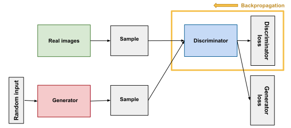

# Generative Adversarial Network

The goal is for the 

## Generator (G)

Tries to generate realistic data.

## Discriminator (D)

Tries to tell real data from fake data.

## Backpropagation

## Gradient Descent

## Convergence

This is when the discriminator can not tell the difference between generated and real data. Thus starting a feedback into the generator possibly causing a collapse in quality.