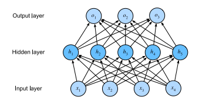

# Multilayer Perceptrons (MLP)

A multilayer perceptron is stacking multiple layers on top of one another. With each layer feeding the layer on top of the other. The first `L - 1` layers are the representation and the final layer is the linear predictor.

Since the input layer does not preform any calculations in it the image above is depicting a two layer MLP. Every neuron influences every neuron of the layer below it.

$n =$ number of examples \
$d =$ number of input features \
$X \in \mathbb{R}^{n \times d}$

$h =$ number of hidden representations (units) \
$H \in \mathbb{R}^{n \times h}$

$H = XW^{(1)} + b^{(1)}$ \
$O = HW^{(2)} + b^{(2)}$

## Linear to Nonlinear

Going directly from one layer to another layer produces a affine function (linear relation ship). Going from one affine function to another affine function results in just a affine function which is a linear relationship. To avoid this a nonlinear *activation function $\sigma$* needs to be applied to each hidden layer unit after the affine transformation. The output is referred to as *activations*.

$H = \sigma(XW^{(1)} + b^{(1)})$ \
$O = HW^{(2)} + b^{(2)}$

## Activation Functions

Activation functions decide whether a neuron should be activated or not by calculating the weighted sum and adding bias to it.

### ReLU Function

The *rectified linear unit* is a simple nonlinear transformation. When given a non negative element of $x$ the value is passed though if given a negative element it is set to $0$.

$$ReLU(x)=max(x,0)$$

#### Parametrized ReLU

An alternative version of the ReLU function that also some negative values through.

$$pReLU=max(0,x)+\alpha \space min(0,x)$$

### Sigmoid Function

Sigmoid Function transforms inputs values in the domain $\mathbb{R}$ to values on the interval of $(0,1)$. Also known as the *squashing function* because of transforming $(-\infty,\infty) \rightarrow (0,1)$.

$$sigmoid(x)=\frac{1}{1+e^{-x}}$$

### Tanh Function

This one also operates like the Sigmoid Function though squashes from $(-\infty,\infty) \rightarrow (-1,1)$.

$$\tanh(x)=\frac{1-e^{-2x}}{1+e^{-2x}}$$

## Propagation

