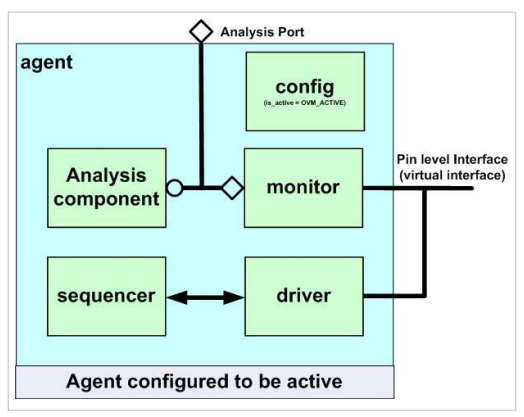
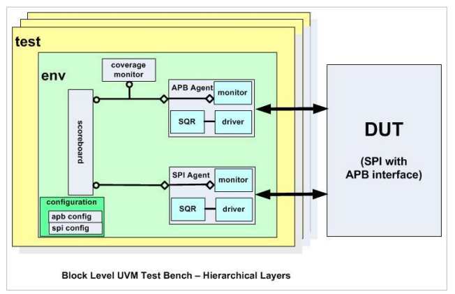

# Universal Verification Methodology

## Agent

\"Most DUTs have a number of different signal interfaces, each of which have their own protocol. The UVM agent
collects together a group of uvm_components focused around a specific pin-level interface. The purpose of the agent is
to provide a verification component which allows users to generate and monitor pin level transactions.\"

## Env

\"In a block level UVM testbench, the environment (env) is used to collect together the agents needed to communicate
with the DUT's interfaces together in one place.\"

