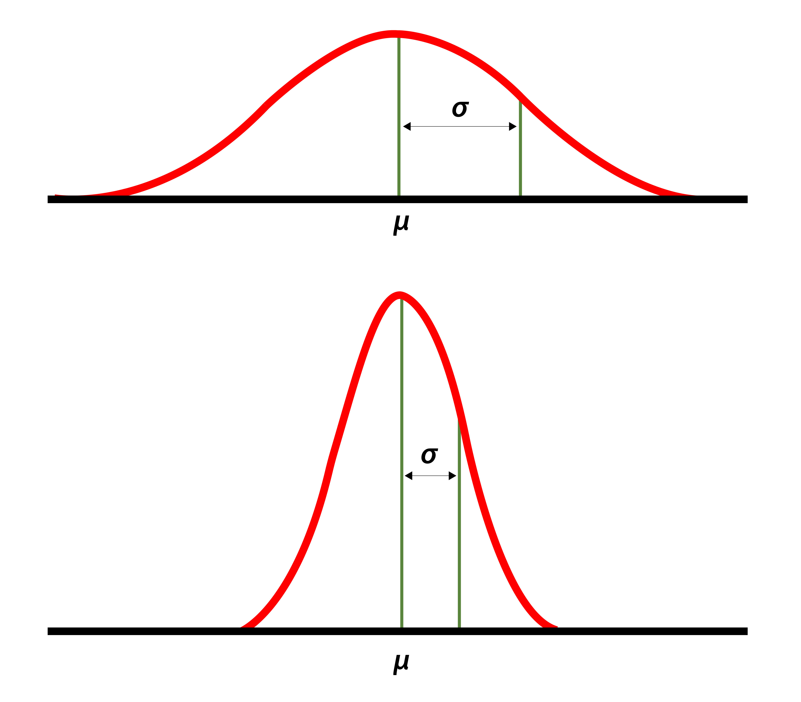

# Standard Deviation

Is the measure of variation of values of a variable about its mean. A low value mean the average tends to the mean and a high value indicates the values are spread out.

$x_i$ = Individual Data Point\
$N$ = Number of Data Points\
$\mu$ = Mean of $x_i$\
$\sigma$ = Standard Deviation\
$\sigma^{2}$ = Variance

$$ \mu = \frac{1}{N} \sum_{i=1}^{N} x_i $$

$$ \sigma^{2} = \frac{1}{N} \sum_{i=1}^{N} (x_i-\mu)^2 $$

$$ \sigma = \sqrt{\sigma^2} $$
