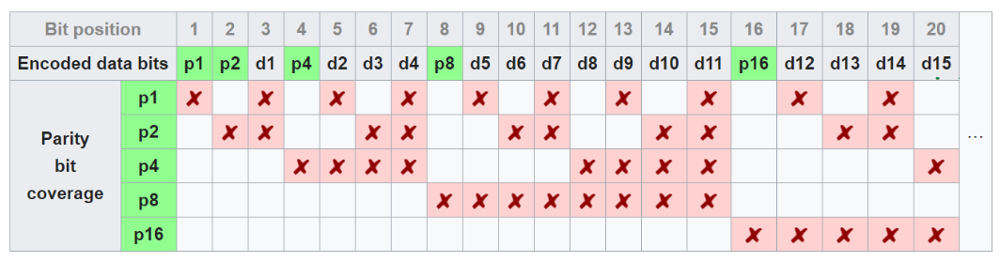

## OSI Model

1. Application
2. Presentation
3. Session
4. Transport
5. Network
6. Data Link
7. Physical

Data flow goes from 

### Application
### Presentation
### Session
### Transport
TCP
UDP
### Network

IP

### Data Link
#### LLC

Guarantee reliability

- Automatic Repeat Request (ARQ)
    - Three types of ARQ protocols
        - stop-and-wait ARQ
        - go-back-N ARQ

        Also known as **Sliding Window Protocol**. Unlike *stop-and-wait* we send *N* number of frames before expecting to receive any acknowledgement back.

        - selective repeat ARQ

        Unlike go-back-N the sender in selective repeat only sends back 
- Forward Error Correction (FEC)
    - Hamming Code
    
    The parity section 1 if Data = Odd and 0 if Data = Even number.
    

#### MAC

Medium Access Control Sublayer

FDMA (Frequency Division Multiple Access)
TDMA (Time Division Multiple Access)

Dynamic MAC Techniques

Polling for heavy traffic

ALOHA

CSMA

